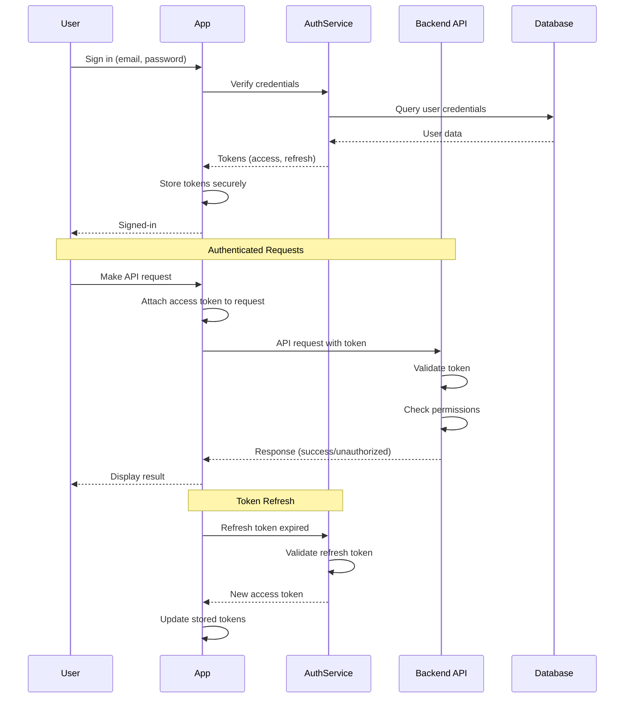

# Authorization Architecture

```mermaid
sequenceDiagram
  participant U as User
  participant A as App
  participant S as AuthService
  participant API as Backend API
  participant DB as Database

  U->>A: Sign in (email, password)
  A->>S: Verify credentials
  S->>DB: Query user credentials
  DB-->>S: User data
  S-->>A: Tokens (access, refresh)
  A->>A: Store tokens securely
  A-->>U: Signed-in
  
  Note over U,API: Authenticated Requests
  U->>A: Make API request
  A->>A: Attach access token to request
  A->>API: API request with token
  API->>API: Validate token
  API->>API: Check permissions
  API-->>A: Response (success/unauthorized)
  A-->>U: Display result
  
  Note over A,S: Token Refresh
  A->>S: Refresh token expired
  S->>S: Validate refresh token
  S-->>A: New access token
  A->>A: Update stored tokens
```
