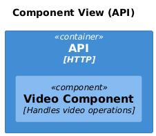
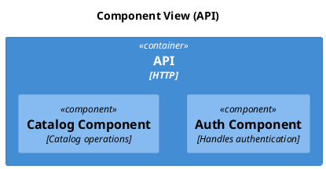

# C4 Component

[Open in PlantUML](https://uml.shafie.org/uml/LOzDJiD038NtSmgJJHC9mIPBXAYoWGLI5rMtbPangSNyH3CE1I4axi0DEGbEKAYwilNvlMTxjMD72Hv9qA4Wx9YEbE7dwnjikxSf32bI572CVSO0HSOdirf3UIz20UI00kXzEXOO2-K2ak1LCo0iYUaPw8sBSEnreijKgQ5WFTkN2Sg1mfKnTqKmonYykU1e_UW8RhhskclttNB5hJ72uWd-oNmlrElDGsDCbw8WHyer3dm9bT9Ao_rskwaQ-31myjKuoc6IQ3dHMOtHUIem2HInHU4Kg-RChH1zwbNU_NNd6GjC0-NPNjJ_gIzITFhWBm00)

## Requirements

- The design shall define a container api named API (HTTP), and implementation work must provision it as a distinct deployable or conceptual element.
- The design shall define a component auth named Auth Component (Handles authentication), and implementation work must provision it as a distinct deployable or conceptual element.
- The design shall define a component catalog named Catalog Component (Catalog operations), and implementation work must provision it as a distinct deployable or conceptual element.
- The development team shall treat each visual element as either a deployable artifact, a runtime capability, or an integration point, and create tasks to build, configure, and test each of them.
- Non-functional requirements (performance, security, observability, resilience) must be applied to all links and components shown in the diagram.

---

_Source: generated from [ArchAiTect Workbench](https://workbench.shafie.org/projects/hover-and-click/)_
