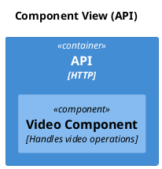

# C4 Component

[Open in PlantUML](https://uml.shafie.org/uml/HOun2y8m48Nt-nLdfXO4buuYbInswr2wIcXkE4Wl8Rtg8FvtOq4xFTx7z-2rYxgiwnpWm3A5rHEURNEopTt6EKKXqGk0iWR2Fy6HwOdLjUzg01j57GlboYK-eYdKbBWDGszgV07kk-h1dkBqgyKQls0Njg4J7sZ1pSMOA3lbA8kfuGtGalZozWC0)

## Requirements

- The design shall define a container api named API (HTTP), and implementation work must provision it as a distinct deployable or conceptual element.
- The design shall define a component videocomponent named Video Component (Handles video operations), and implementation work must provision it as a distinct deployable or conceptual element.
- The development team shall treat each visual element as either a deployable artifact, a runtime capability, or an integration point, and create tasks to build, configure, and test each of them.
- Non-functional requirements (performance, security, observability, resilience) must be applied to all links and components shown in the diagram.

---

_Source: generated from [ArchAiTect Workbench](https://workbench.shafie.org/projects/hover-and-click/)_
