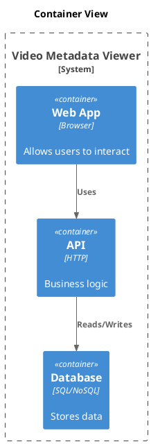

# C4 Container

[Open in PlantUML](https://uml.shafie.org/uml/NL1DImCn4BtdLunxQa7OIuyYRTU3WafjQtiiivj10ccoP2OiHVplJb9Gz1BUpFkOHvOic2IVlRbnOV3P4jnrYxPRdBeO15sWT6-CEF44FniuE9gCsLrOw7nQnnmifikCwtmBpS5PYl12WXO5gvfICuTF0xyXiubwrHwfXzKuDWhNAKwiGeKhxnL3rf518hWWb72GPlud0aTNn9kduddSxpSr9hEIpE3ZXnl-EMov-Q2jUcGgwjtRS_iQzQs3n4GCfRNwlepPah_sl5vwPs8bohOkQjgMq79xJ4ugQPOKh7xeDm00)

## Requirements

- The design shall define a container web named Web App (Browser), and implementation work must provision it as a distinct deployable or conceptual element.
- The design shall define a container api named API (HTTP), and implementation work must provision it as a distinct deployable or conceptual element.
- The design shall define a container db named Database (SQL/NoSQL), and implementation work must provision it as a distinct deployable or conceptual element.
- The architecture shall include a relationship where web uses api, and this connection must be implemented with appropriate protocols, security, and error handling.
- The architecture shall include a relationship where api reads/writes db, and this connection must be implemented with appropriate protocols, security, and error handling.
- The development team shall treat each visual element as either a deployable artifact, a runtime capability, or an integration point, and create tasks to build, configure, and test each of them.
- Non-functional requirements (performance, security, observability, resilience) must be applied to all links and components shown in the diagram.

---

_Source: generated from [ArchAiTect Workbench](https://workbench.shafie.org/projects/hover-and-click/)_
