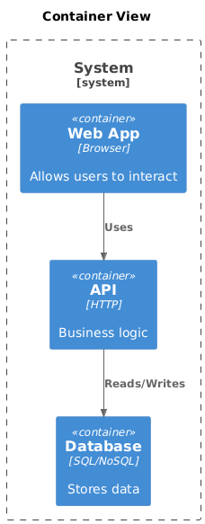

# C4 Container

[Open in PlantUML](https://uml.shafie.org/uml/NL3BJWCn3BpdAynUsag8Ndf4g0yE804gRMcFgsnYseXiiegzb0eXyG_y8Lz2abL1z18vCvxnsBsrqUZX7bbgoHBM1lSOuFlp2zIeLDwnD2u2siXja3KGjvNeJO0En5W3xoI3jDRl2Lh2GC0UNgC7r4T7_mpuPeYDsqOc3ekTZNUWh54l2UGTrXT2Z8bbuBQsuimuPLkDS3aR3MUZSdPCSIK46xO8lqZEAyGofocdldLQXaE_ItSEHKSK0tWNyAVgxx6Av0Ohc3HD4SjfY1jWIENaP1lZ68DKN0p-MSZ6fERvRTBSh5RpRDDI98d0-grH9mgTPbx7arIIC7Kl7--63pw--SC-844wMTHzY0NQBcOtw8cG8fxG36Ip1KfDmqqmd4anHgVZ0Ny0)

## Requirements

- The design shall define a container web named Web App (Browser), and implementation work must provision it as a distinct deployable or conceptual element.
- The design shall define a container api named API (HTTP), and implementation work must provision it as a distinct deployable or conceptual element.
- The design shall define a container db named Database (SQL/NoSQL), and implementation work must provision it as a distinct deployable or conceptual element.
- The architecture shall include a relationship where web uses api, and this connection must be implemented with appropriate protocols, security, and error handling.
- The architecture shall include a relationship where api reads/writes db, and this connection must be implemented with appropriate protocols, security, and error handling.
- The development team shall treat each visual element as either a deployable artifact, a runtime capability, or an integration point, and create tasks to build, configure, and test each of them.
- Non-functional requirements (performance, security, observability, resilience) must be applied to all links and components shown in the diagram.

---

_Source: generated from [ArchAiTect Workbench](https://workbench.shafie.org/projects/hover-and-click/)_
