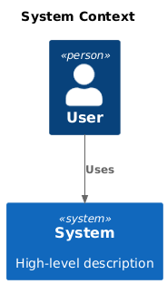
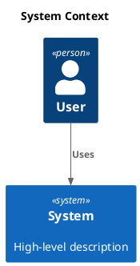

# C4 Context

[Open in PlantUML](https://uml.shafie.org/uml/FOuzJWD138Lxdy9iao0HQBP4A6WRcaW8HDfec36x5lCJZRr9wBW3D-GaE1gWilril_SjjXoeu8RK1QSEjqn7glZz-OM-t_cIbKwAWTrONKBH-HKMzoWVefHG9wVeOYn7mLce2ch1WpbW-lChRqWd5kKysiQYx79VClh8_lqiwaJf6c0jwghEAS85Pn_dG7Wxz3T3lnkCmN6cUWUWh97mkQKF3GxWqP9BNfu9hh1xiT9TGZjQDbAJsznPzy3Zj8fqe8Y1n5VUAvTiBqyKVqt-lynCR0Dhoi7WVW00)

## Requirements

- The design shall define a person user named User, and implementation work must provision it as a distinct deployable or conceptual element.
- The design shall define a system system named System (High-level description), and implementation work must provision it as a distinct deployable or conceptual element.
- The architecture shall include a relationship where user uses system, and this connection must be implemented with appropriate protocols, security, and error handling.
- The development team shall treat each visual element as either a deployable artifact, a runtime capability, or an integration point, and create tasks to build, configure, and test each of them.
- Non-functional requirements (performance, security, observability, resilience) must be applied to all links and components shown in the diagram.

---

_Source: generated from [ArchAiTect Workbench](https://workbench.shafie.org/projects/hover-and-click/)_
