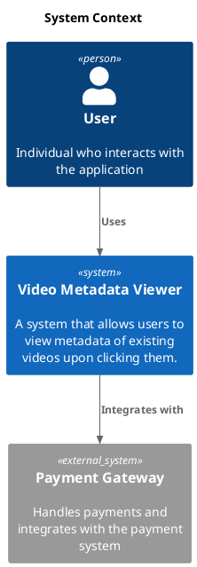

# C4 Context

[Open in PlantUML](https://uml.shafie.org/uml/PL7BJiD03BplLvYSWeJWqYD2HLK5FI1L87gjhAn9B3QxKUmqoT_ZD2aFSR8ydfqPUzUYs6fN1tV5iGYT9xZVhEusg-CcHQL17vnJra3mDefI3Glit9vQIJ7lXDeRoDwjP5PtqVE9VOS1-Ye16xd5GWLwrWgq8i2c2LoWSehPjNEpR2xdOW87zfJWXHGzAiA1gP-L7s7cc0WgO0Yf5vZS1JJ1oNXGNrwb3w21HJcMDZ51OpOfGc7EdnDeGUhR7_lZTj2ymR6cg2KgzJYQutu6u6b6fX3F67qWWOKhOFrvoR8rqgyj5yAIUN9wfR0SwtjNEvhOQ9fSi7yXTd_59wKrHMy_zWK0)

## Requirements

- The design shall define a person user named User (Individual who interacts with the application), and implementation work must provision it as a distinct deployable or conceptual element.
- The design shall define a system system named Video Metadata Viewer (A system that allows users to view metadata of existing videos upon clicking them.), and implementation work must provision it as a distinct deployable or conceptual element.
- The architecture shall include a relationship where user uses system, and this connection must be implemented with appropriate protocols, security, and error handling.
- The architecture shall include a relationship where system integrates with paymentgateway, and this connection must be implemented with appropriate protocols, security, and error handling.
- The development team shall treat each visual element as either a deployable artifact, a runtime capability, or an integration point, and create tasks to build, configure, and test each of them.
- Non-functional requirements (performance, security, observability, resilience) must be applied to all links and components shown in the diagram.

---

_Source: generated from [ArchAiTect Workbench](https://workbench.shafie.org/projects/hover-and-click/)_
