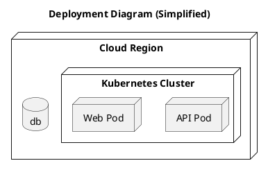

# Deployment View

[Open in PlantUML](https://uml.shafie.org/uml/JSwx2i9048NXVfvYIALl4KaQiGbQMCyonx2mbx0xYuZatGq4nU8q_zUSlfeKQp6GUGlW4Kl8huXaF7gPYqG-t7nSWdzuw94ePGLtGyXD-OhPvzJncvZtVcaE9S5GUGYj6igkNpzDPvwoTYoLPV5_SeVxoHDkatMRYecJ2bP7Ar6FfDlN3m00)

## Requirements

- The deployment model shall include a node api representing API Pod, and infrastructure tasks must ensure it is provisioned, monitored, and reachable by its peers.
- The deployment model shall include a node web representing Web Pod, and infrastructure tasks must ensure it is provisioned, monitored, and reachable by its peers.
- The deployment model shall include a database db, and infrastructure tasks must provision, secure, and monitor it.
- The development team shall treat each visual element as either a deployable artifact, a runtime capability, or an integration point, and create tasks to build, configure, and test each of them.
- Non-functional requirements (performance, security, observability, resilience) must be applied to all links and components shown in the diagram.

---

_Source: generated from [ArchAiTect Workbench](https://workbench.shafie.org/projects/hover-and-click/)_
