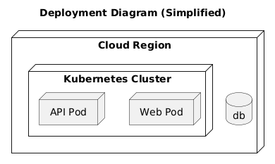
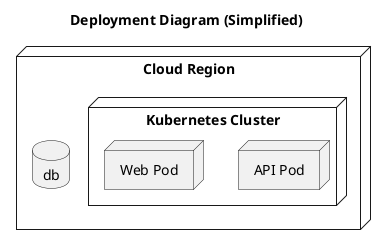

# Deployment View

[Open in PlantUML](https://uml.shafie.org/uml/JOzBIaD144NdlOfB9j69Qp0a4n4XACHnTRhoKjYVHrUrpo01z-0ENOaTOjH1JUufxcU-aS053smKo0WRuOahlZu-4NYCvP0u6uBGK2b1hNatNq0FQfnWUp9GZ6LIDEMgi8BNxe1qyIixy9keIHuwwL7zSomPsoZRbvDeUqutpjsgKRMMeZEno5ZzXQz-mg-U98rHTiBXshbS0cEsZAK5FF8W9S_mxe2pVjyyryp6YcLilMmzqmjVhE-mBc46Kj0e_yWp-ryoiU_asE-qnPCoWdV7tfPpw5s_0G00)

## Requirements

- The deployment model shall include a node api representing API Pod, and infrastructure tasks must ensure it is provisioned, monitored, and reachable by its peers.
- The deployment model shall include a node web representing Web Pod, and infrastructure tasks must ensure it is provisioned, monitored, and reachable by its peers.
- The deployment model shall include a database db, and infrastructure tasks must provision, secure, and monitor it.
- The development team shall treat each visual element as either a deployable artifact, a runtime capability, or an integration point, and create tasks to build, configure, and test each of them.
- Non-functional requirements (performance, security, observability, resilience) must be applied to all links and components shown in the diagram.

---

_Source: generated from [ArchAiTect Workbench](https://workbench.shafie.org/projects/hover-and-click/)_
