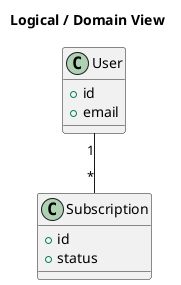

# Logical View

[Open in PlantUML](https://uml.shafie.org/uml/LOvDIWD148NtVOh7R09AbDn0mQMknEmhtUMai7iwT5KRGmXu1s_eIQm91dHJYte_trki9N754nibCi9QUCyDtvzVo7MKI1b9Q6nKeDOtON4FFQXnWMt9G3dNlQ8hDuLLl7iSvL9MNy4VeYRJw8fptBch4sAM-3O_RSlb9eGxDMhMImucbXcFl-HRFDH2CfrNXH0pgUB5MJW6u5hIVDaTEPmkydFVQ6ooCt7G7viZhEliEnSCgm7B9OQhuL_2j_2KVCaF)

## Requirements

- This diagram defines the primary elements and relationships for Logical View, and implementation must ensure that all shown components, connections, and responsibilities are realized in code, configuration, and infrastructure.
- The development team shall treat each visual element as either a deployable artifact, a runtime capability, or an integration point, and create tasks to build, configure, and test each of them.
- Non-functional requirements (performance, security, observability, resilience) must be applied to all links and components shown in the diagram.

---

_Source: generated from [ArchAiTect Workbench](https://workbench.shafie.org/projects/hover-and-click/)_
