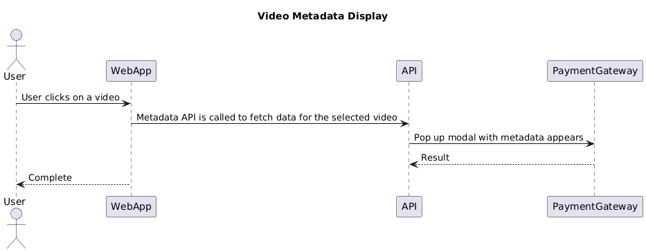
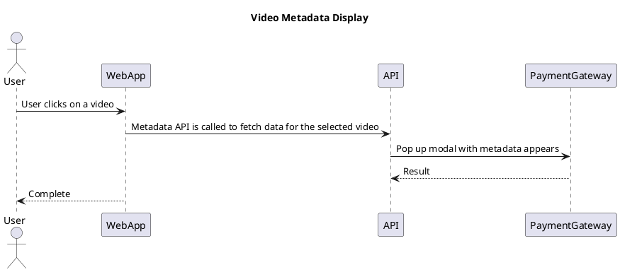

# Sequence Diagram

[Open in PlantUML](https://uml.shafie.org/uml/LP11RW8n34NtESM_01UOHGKgKjL5fH4IT6qIeudgJAo91yJjIQ20Pcd__9UNh8lHP7CIPz64SOY1CtxOA90Hjh6eqDKvyfOdx0jFJciX-gWq6dxvk55Th3RzzsBkwPfuj2yolZHIOs3ryL_jxanuYVwl88yWd9k2UyJjO0LsRwCw8HPu4k40opYn-G7tx5GLRM0K5lPMumUgLIfdATAXpufPaN8WmINQWFIyX5IPfkAM5QoUDZikizZBiQxRApfyvgJ2niwjUGprLsy0)

## Requirements

- The system shall support an interaction where User sends the message 'User clicks on a video' to WebApp, and the platform must be able to process this exchange end-to-end.
- The system shall support an interaction where WebApp sends the message 'Metadata API is called to fetch data for the selected video' to API, and the platform must be able to process this exchange end-to-end.
- The system shall support an interaction where API sends the message 'Pop up modal with metadata appears' to PaymentGateway, and the platform must be able to process this exchange end-to-end.
- The system shall support an interaction where PaymentGateway sends the message 'Result' to API, and the platform must be able to process this exchange end-to-end.
- The system shall support an interaction where WebApp sends the message 'Complete' to User, and the platform must be able to process this exchange end-to-end.
- The development team shall treat each visual element as either a deployable artifact, a runtime capability, or an integration point, and create tasks to build, configure, and test each of them.
- Non-functional requirements (performance, security, observability, resilience) must be applied to all links and components shown in the diagram.

---

_Source: generated from [ArchAiTect Workbench](https://workbench.shafie.org/projects/hover-and-click/)_
