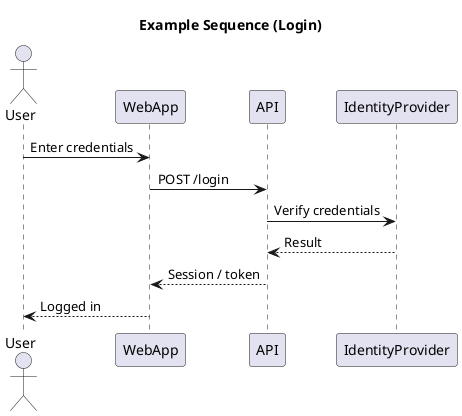

# Sequence Diagram

[Open in PlantUML](https://uml.shafie.org/uml/NP31KW8n44Jl-Og-eGValWSB3Xoeaf8INSzXTrXIP9CrColipN_m3_qI9oAMS4gbf-TDLuzALrF4aiJMLYnAHmTA-Fhu1DDRJw4YrCusoRPWwJTcD0CFBDH2TbPWlOy7Hi-K61BnhljepxIu1HqTYmkDJlIGEhiOK7bNxRCeEshlZ9cos2HzwuquyOJvqRQTlkjpX9k7sBXmQuoj92Qyw3dJwOghN6U3u9Ksiwwxa6QhnSL_KLDG-h1ACKT9ncGAnlU_omNcGLIe4lquhMTpccIFqWgi7jVFcFWSnQYGzMjgWPAIsmuNc6iJncVY4t7lvGJxbsHDp4vxccYbUmf_ETIIGnVGEXggeJdCb4AjpNq3)

## Requirements

- The system shall support an interaction where User sends the message 'Enter credentials' to WebApp, and the platform must be able to process this exchange end-to-end.
- The system shall support an interaction where WebApp sends the message 'POST /login' to API, and the platform must be able to process this exchange end-to-end.
- The system shall support an interaction where API sends the message 'Verify credentials' to IdentityProvider, and the platform must be able to process this exchange end-to-end.
- The system shall support an interaction where IdentityProvider sends the message 'Result' to API, and the platform must be able to process this exchange end-to-end.
- The system shall support an interaction where API sends the message 'Session / token' to WebApp, and the platform must be able to process this exchange end-to-end.
- The system shall support an interaction where WebApp sends the message 'Logged in' to User, and the platform must be able to process this exchange end-to-end.
- The development team shall treat each visual element as either a deployable artifact, a runtime capability, or an integration point, and create tasks to build, configure, and test each of them.
- Non-functional requirements (performance, security, observability, resilience) must be applied to all links and components shown in the diagram.

---

_Source: generated from [ArchAiTect Workbench](https://workbench.shafie.org/projects/hover-and-click/)_
