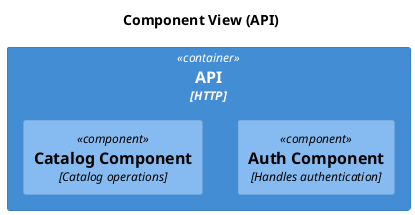

# C4 Component

Generated diagram stub for **Simple Login System**.

```plantuml
'Simple Login System – c4_component diagram stub
'A basic login system for user authentication with features such as username/password validation.

@startuml
!include <C4/C4_Component>

title Component View (API)

Container(api, "API", "HTTP") {
  Component(auth, "Auth Component", "Handles authentication")
  Component(catalog, "Catalog Component", "Catalog operations")
}

@enduml

```
