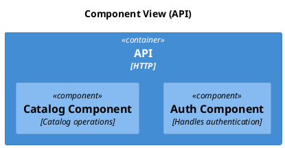

# C4 Component

[Open in PlantUML viewer](https://uml.shafie.org/uml/LP1DQiD038NtSmhLczXGcesNfJHuaq8NWOHkWp8pYGNpOsOqDQKKUeVUi2Ufuf06hoGUxnFlQR4bFpWBh_540ROVcQs7t-yVqErUHp_4O0E38Jmbz92v7DHY1GVCfC5DJBumnvYWP9i02_V2a4Qc660axk5eaKko6NBHFM2Ud06zNGwOynYJWNTqP2RaGQddp9YuUAVkA6XNZ8N7hbrsxRwxPdfIYeab-Ry2RsH7g5URbqQfBWP62ZRLED0zLA9MCjQxtQPgu5F1ZQlFYSyM6JTrScCmJbBFArNDZ1OHvHDYxoxR_CPLZ8DD4vw5_vAADXWf-0S0)

_Source: generated from [ArchAiTect Workbench](https://workbench.shafie.org/projects/test-2/)_
