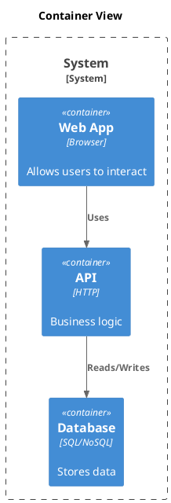

# C4 Container

[Open in PlantUML viewer](https://uml.shafie.org/uml/NL3DIWCn4BxdASQzj0Mnbnv5-kD1eKXjgpsMsMJQ1dQJ9JDnAIBu3hwXJs8sYufUmkJxcNpv1XjRDnN1qX-jWysPXMhuVFy0FTbhxmIjem36uZ5W3IonL8CPbCXMGvKzt7iEFa3afCKe9t9YDOhr3beh9pWGIWp4m56V03ah7TOqRf2vzS702rRMPCkLKbCM31BhIbrOfwje2AuNa_5YibzyPxfHIgoav3y8F5jgbUh_i9_xw0o6yx3FTmb5JnGZU5NmwngsL2PoHoNCcgP8uppuDiNhnbbLfJcdPH0FrWa5r5AC_gp0ndRYrNtdkTjkLtbDv4GovvhqFuVfthn5mTGaTUhDutByuDEPB-Axib8Tc7nlQarL7xD_w8c94zwX6SZBreI6nxjW9PDgIiwa0hy0)

_Source: generated from [ArchAiTect Workbench](https://workbench.shafie.org/projects/test-2/)_
