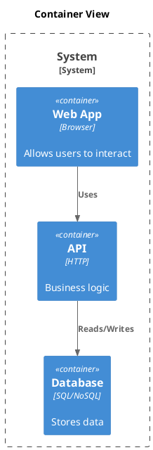

# C4 Container

Generated diagram stub for **Simple Login System**.

```plantuml
'Simple Login System – c4_container diagram stub
'A basic login system for user authentication with features such as username/password validation.

@startuml
!include <C4/C4_Container>

title Container View

System_Boundary(system, "System") {
  Container(web, "Web App", "Browser", "Allows users to interact")
  Container(api, "API", "HTTP", "Business logic")
  Container(db, "Database", "SQL/NoSQL", "Stores data")
}
Rel(web, api, "Uses")
Rel(api, db, "Reads/Writes")

@enduml

```
