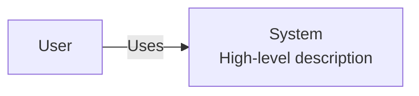

# C4 Context

[Open in PlantUML](https://uml.shafie.org/uml/FOuxJWD1343xEONP9a42qco9KD0s51I8Y3foPfnTI_DPZJq9TDo16t8I9ZiHbR_FVgiTXzaJlAQH8-o-H2d0x_SFs7vlKrJwL72COyO0ekLWLizmG64BVY6a4SUKeGXbmA8JHMMBoYd2cNM28w6MJ09Ix0GeosR4G9iPHSufEpYXPxSW3yPiHJ5h2TxSSBI-E8B7eTyC_NweHiYHyfCnobgzhyP3KpNcZRAakBvyk8FkeuRkrhIbTNEjxLPtDNlXSRhtT28FZiHcdYyE5NadVptoJzLZKYTcIz5LkJy0)

## Requirements

- The design shall define a person user named User, and implementation work must provision it as a distinct deployable or conceptual element.
- The design shall define a system system named System (High-level description), and implementation work must provision it as a distinct deployable or conceptual element.
- The architecture shall include a relationship where user uses system, and this connection must be implemented with appropriate protocols, security, and error handling.

---

_Source: generated from [ArchAiTect Workbench](https://workbench.shafie.org/projects/test-2/)_
