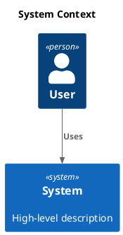

# C4 Context

Generated diagram stub for **Simple Login System**.

```plantuml
'Simple Login System – c4_context diagram stub
'A basic login system for user authentication with features such as username/password validation.

@startuml
!include <C4/C4_Container>

title System Context

Person(user, "User")
System(system, "System", "High-level description")
Rel(user, system, "Uses")

@enduml

```
