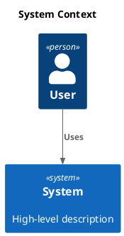

# C4 Context

[Open in PlantUML viewer](https://uml.shafie.org/uml/FOuxJWD1343xEONP9a42qco9KD0s51I8Y3foPfnTI_DPZJq9TDo16t8I9ZiHbR_FVgiTXzaJlAQH8-o-H2d0x_SFs7vlKrJwL72COyO0ekLWLizmG64BVY6a4SUKeGXbmA8JHMMBoYd2cNM28w6MJ09Ix0GeosR4G9iPHSufEpYXPxSW3yPiHJ5h2TxSSBI-E8B7eTyC_NweHiYHyfCnobgzhyP3KpNcZRAakBvyk8FkeuRkrhIbTNEjxLPtDNlXSRhtT28FZiHcdYyE5NadVptoJzLZKYTcIz5LkJy0)

_Source: generated from [ArchAiTect Workbench](https://workbench.shafie.org/projects/test-2/)_
