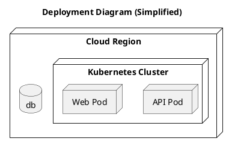

# Deployment View

[Open in PlantUML viewer](https://uml.shafie.org/uml/JT0xJWGn30RWFgUmfbbeu0giTXi4nOejg9s9PzPI7gFOORH2At47RiX9C3EyYZJvyzkViZbocYB1Onavm_4iIWa-tjuXq1JBEL5M28nZnGIYpRlD5ZmAzn2NXgoDeLHeGXMmwSawtADooJ2pdc0Wr5P9G5f_0fJbPSP4jnEApAK6UC78OQdSE7SdYbLRYavPpRR_e-o_ALSBcmUcSErSBe6WsyNI0ZpHQ5CwU7K0w_r3yxQEr02xs8nRr_GdtnxkuL12zoN3YVybp-H_avcy9HSxvaJx0eBWtSMqb8DPFm40)

_Source: generated from [ArchAiTect Workbench](https://workbench.shafie.org/projects/test-2/)_
