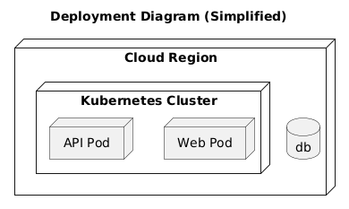

# Deployment View

[Open in PlantUML](https://uml.shafie.org/uml/JT0xJWGn30RWFgUmfbbeu0giTXi4nOejg9s9PzPI7gFOORH2At47RiX9C3EyYZJvyzkViZbocYB1Onavm_4iIWa-tjuXq1JBEL5M28nZnGIYpRlD5ZmAzn2NXgoDeLHeGXMmwSawtADooJ2pdc0Wr5P9G5f_0fJbPSP4jnEApAK6UC78OQdSE7SdYbLRYavPpRR_e-o_ALSBcmUcSErSBe6WsyNI0ZpHQ5CwU7K0w_r3yxQEr02xs8nRr_GdtnxkuL12zoN3YVybp-H_avcy9HSxvaJx0eBWtSMqb8DPFm40)

## Requirements

- The deployment model shall include a node api representing API Pod, and infrastructure tasks must ensure it is provisioned, monitored, and reachable by its peers.
- The deployment model shall include a node web representing Web Pod, and infrastructure tasks must ensure it is provisioned, monitored, and reachable by its peers.
- The deployment model shall include a database db, and infrastructure tasks must provision, secure, and monitor it.
- The development team shall treat each visual element as either a deployable artifact, a runtime capability, or an integration point, and create tasks to build, configure, and test each of them.
- Non-functional requirements (performance, security, observability, resilience) must be applied to all links and components shown in the diagram.

---

_Source: generated from [ArchAiTect Workbench](https://workbench.shafie.org/projects/test-2/)_
