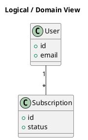

# Logical View

[Open in PlantUML viewer](https://uml.shafie.org/uml/LOvDIWGn48NtESMZDmFAE7W31PVkcd5VdMIc2_BJf2esCWnu1s_eIKn71TtKekfxzRxTo7497i_vp0dZcwYF-7p_G6WBIm6EwLmeGhHEPlU8YOHjloR8DtxA1LLy0LMTVTAMKyu9A-kCaoUjnGkasXaadKmK_M4XaJKNXrSAx7hapfW7KIfQOp3A-YEsUHpmb2ErqXVsgp4sj3IEM-l50BVijkaR4SprzppMIMpXfTlymLg5Ljcu_c2u7x3VOxWP_YMQYq-kcNm1)

_Source: generated from [ArchAiTect Workbench](https://workbench.shafie.org/projects/test-2/)_
