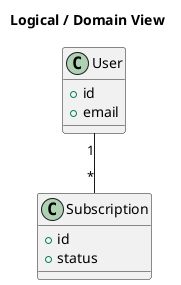

# Logical View

[Open in PlantUML](https://uml.shafie.org/uml/LOvDIWGn48NtESMZDmFAE7W31PVkcd5VdMIc2_BJf2esCWnu1s_eIKn71TtKekfxzRxTo7497i_vp0dZcwYF-7p_G6WBIm6EwLmeGhHEPlU8YOHjloR8DtxA1LLy0LMTVTAMKyu9A-kCaoUjnGkasXaadKmK_M4XaJKNXrSAx7hapfW7KIfQOp3A-YEsUHpmb2ErqXVsgp4sj3IEM-l50BVijkaR4SprzppMIMpXfTlymLg5Ljcu_c2u7x3VOxWP_YMQYq-kcNm1)

_Source: [ArchAiTect Workbench project](https://docs.shafie.org/projects/test-2/)_

## Requirements

- This diagram defines the primary elements and relationships for Logical View, and implementation must ensure that all shown components, connections, and responsibilities are realized in code, configuration, and infrastructure.
- Each visual element should map to either a deployable artifact, runtime capability, or integration point, with implementation tasks to build, configure, and test each one.
- Non-functional requirements (performance, security, monitoring, resilience) must be applied to all links and components shown.
