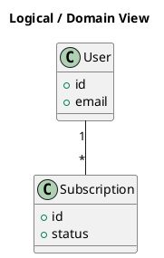

# Logical

Generated diagram stub for **Simple Login System**.

```plantuml
'Simple Login System – logical diagram stub
'A basic login system for user authentication with features such as username/password validation.

@startuml
title Logical / Domain View

class User {
  +id
  +email
}

class Subscription {
  +id
  +status
}

User "1" -- "*" Subscription

@enduml

```
