# Sequence Diagram

[Open in PlantUML](https://uml.shafie.org/uml/NP6zRW8n48HxFyLs90MXloA2WW8fKb0kF_LYByUAEz_5kuPSbtV86-P9OfiG1KgFPyQVnfEQkw4bUEWRzb2FejJ1z-SN2Br7yfR0CJO1En2D6pDPm0Q5BRJ5BoV_jWyGXG9Wr1rvPOlAlOSZwmwsX1e32KYqEq0fJeyTpGOKEVR1mG5RTYLoPynS58F6hZNAciYM7rW8wpFGJM6zDGQjfeTVKfqPKeGj3-WLtcYp68OBQR5UNPnNBbFgk0xzWLtAczm2q_lVS0LBhqcmWOeJMp6dc-n9RHMi7-jdc9KPJ1AoVjrQmIi5teuNDTScc9uRdqXYgwUoVoGrYUGnPw3zdlmVHx9aw2f_NKCE4eUPatTfkHy0)

## Requirements

- The system shall support an interaction where User sends the message 'Enter credentials' to WebApp, and this exchange shall be implemented, logged, and testable end-to-end.
- The system shall support an interaction where WebApp sends the message 'POST /login' to API, and this exchange shall be implemented, logged, and testable end-to-end.
- The system shall support an interaction where API sends the message 'Verify credentials' to IdentityProvider, and this exchange shall be implemented, logged, and testable end-to-end.
- The system shall support an interaction where IdentityProvider sends the message 'Result' to API, and this exchange shall be implemented, logged, and testable end-to-end.
- The system shall support an interaction where API sends the message 'Session / token' to WebApp, and this exchange shall be implemented, logged, and testable end-to-end.
- The system shall support an interaction where WebApp sends the message 'Logged in' to User, and this exchange shall be implemented, logged, and testable end-to-end.

```plantuml
'Simple Login System – sequence diagram stub
'A basic login system for user authentication with features such as username/password validation.

@startuml
title Example Sequence (Login)

actor User
participant WebApp
participant API
participant IdentityProvider

User -> WebApp: Enter credentials
WebApp -> API: POST /login
API -> IdentityProvider: Verify credentials
IdentityProvider --> API: Result
API --> WebApp: Session / token
WebApp --> User: Logged in

@enduml
```

---

_Source: generated from [ArchAiTect Workbench](https://workbench.shafie.org/projects/test-2/)_
