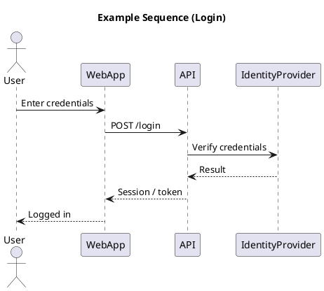

# Sequence

Generated diagram stub for **Simple Login System**.

```plantuml
'Simple Login System – sequence diagram stub
'A basic login system for user authentication with features such as username/password validation.

@startuml
title Example Sequence (Login)

actor User
participant WebApp
participant API
participant IdentityProvider

User -> WebApp: Enter credentials
WebApp -> API: POST /login
API -> IdentityProvider: Verify credentials
IdentityProvider --> API: Result
API --> WebApp: Session / token
WebApp --> User: Logged in

@enduml

```
