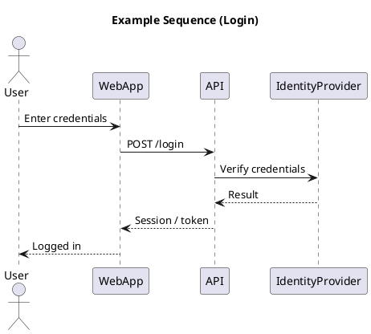

# Sequence Diagram

[Open in PlantUML viewer](https://uml.shafie.org/uml/NP6zRW8n48HxFyLs90MXloA2WW8fKb0kF_LYByUAEz_5kuPSbtV86-P9OfiG1KgFPyQVnfEQkw4bUEWRzb2FejJ1z-SN2Br7yfR0CJO1En2D6pDPm0Q5BRJ5BoV_jWyGXG9Wr1rvPOlAlOSZwmwsX1e32KYqEq0fJeyTpGOKEVR1mG5RTYLoPynS58F6hZNAciYM7rW8wpFGJM6zDGQjfeTVKfqPKeGj3-WLtcYp68OBQR5UNPnNBbFgk0xzWLtAczm2q_lVS0LBhqcmWOeJMp6dc-n9RHMi7-jdc9KPJ1AoVjrQmIi5teuNDTScc9uRdqXYgwUoVoGrYUGnPw3zdlmVHx9aw2f_NKCE4eUPatTfkHy0)

_Source: generated from [ArchAiTect Workbench](https://workbench.shafie.org/projects/test-2/)_
