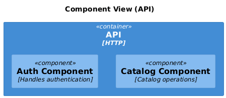
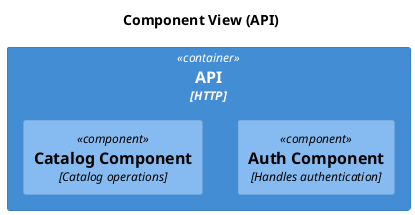

# C4 Component

[Open in PlantUML](https://uml.shafie.org/uml/LL0nJWCn4EpzYkMQ95A09YL2H4S15IcYjD6UlNTPnMUVl3QHG4ZyWH_o4lOIXIYDrnhDpCxiPCEE8hm5UAOUWuELnzp6rCFlzm_OnTR6VeY1GWR7s2NiGN9fp6G9KXgnYOVCCTmsAEHWE8lrWIAK1784j9P4O7G_OBOxU1ztoXnYsrBYq45Bc4iY0SzxWa5rCQ3d3xLqABicOd8d0rtbJa5j35bZtHdp91bJBhqtDnoiBuxWeLxSrujjVGx_Q4pcx0d-4TWm7M2wNBtEZAdL2pbGckB0SwWKhNIyhDUhQWQV1YwwAPQy6oawBkYHhQcyTXW92h75yJBLx4gj8FhOARq-_Quzpc3K6npbelelhKZ1QS4_)

## Requirements

- The design shall define a container api named API (HTTP), and implementation work must provision it as a distinct deployable or conceptual element.
- The design shall define a component auth named Auth Component (Handles authentication), and implementation work must provision it as a distinct deployable or conceptual element.
- The design shall define a component catalog named Catalog Component (Catalog operations), and implementation work must provision it as a distinct deployable or conceptual element.
- The development team shall treat each visual element as either a deployable artifact, a runtime capability, or an integration point, and create tasks to build, configure, and test each of them.
- Non-functional requirements (performance, security, observability, resilience) must be applied to all links and components shown in the diagram.

---

_Source: generated from [ArchAiTect Workbench](https://workbench.shafie.org/projects/test-8/)_
