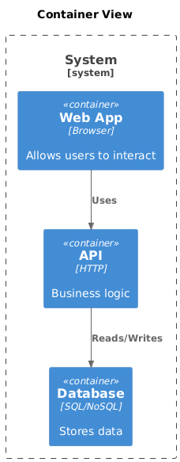
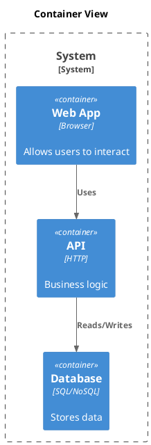

# C4 Container

[Open in PlantUML](https://uml.shafie.org/uml/NL3BJWCn3BpdAqmlBLAXbnuHeey3I0XA2_HOUHEtZSWcgzXBLH0I_y0VyYKakoeLN2pRuncFtNssXWBSUvXIYTx0pA6iGopX-_CBz72bWnUqdY8OYvk89R3KXUgEWEk2TRILsE3F2cGoK1t8AK3D51aa06fDp93LToXw2wzv9_SXhDSKhT_0cb3gI0pElX1KYHSyElkM90tojWWOJIkGLfdMQ3P6NiwLkcB1A7Nfr8drsjM6u68o74o6gyd1_ALIOiKH_7RWsT9EgSMUXShLEDJUODptkAdxq6c1pYcyApYoUZig4hYa0aPLrKdfE8PTEZId8-TIVhpR9eCHjNHE_qXWPVFmx2PphXyVPurCpGbCNt9XO_K_XiaxfoYOlvod5m-tWxkGObD8oAyp2K-y3pKdrzfi5pqnSUhdRjDenEQ4XWVBQAK1rHLvanxu0m00)

## Requirements

- The design shall define a container web named Web App (Browser), and implementation work must provision it as a distinct deployable or conceptual element.
- The design shall define a container api named API (HTTP), and implementation work must provision it as a distinct deployable or conceptual element.
- The design shall define a container db named Database (SQL/NoSQL), and implementation work must provision it as a distinct deployable or conceptual element.
- The architecture shall include a relationship where web uses api, and this connection must be implemented with appropriate protocols, security, and error handling.
- The architecture shall include a relationship where api reads/writes db, and this connection must be implemented with appropriate protocols, security, and error handling.
- The development team shall treat each visual element as either a deployable artifact, a runtime capability, or an integration point, and create tasks to build, configure, and test each of them.
- Non-functional requirements (performance, security, observability, resilience) must be applied to all links and components shown in the diagram.

---

_Source: generated from [ArchAiTect Workbench](https://workbench.shafie.org/projects/test-8/)_
