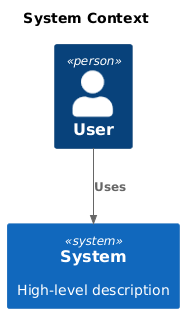
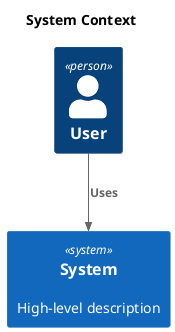

# C4 Context

[Open in PlantUML](https://uml.shafie.org/uml/FO_FJiCm3CRlUGhJouQqmQL7X3QL0pSc45mdDt7RY3IfOdVyEV4El25FWjl2Bd6S-FjzdrSltb62XmXtr6DqS0WeJSez_7nzWosFDaMXTm7diStO0yjOczKUUApPPZ-8Jt5R8vE3uL-g1unCcK4IeBN431Fx3SLsS9eSUGEfQIZxs493A6CcXk1V2GRLfOZ1VohI8NTrmkmMW5gv9UOSAygLCJiMp3BsmLpuQCFe26wgyhegZvNEe8-KRuqHBu7WwOE5UgYMdOmvp5xhAUi6YcSjnQLPXjOy5trU-a9lzxxjje5E5C3HUNkLF5BuWvnL2cFzCJkAJiFz0W00)

## Requirements

- The design shall define a person user named User, and implementation work must provision it as a distinct deployable or conceptual element.
- The design shall define a system system named System (High-level description), and implementation work must provision it as a distinct deployable or conceptual element.
- The architecture shall include a relationship where user uses system, and this connection must be implemented with appropriate protocols, security, and error handling.
- The development team shall treat each visual element as either a deployable artifact, a runtime capability, or an integration point, and create tasks to build, configure, and test each of them.
- Non-functional requirements (performance, security, observability, resilience) must be applied to all links and components shown in the diagram.

---

_Source: generated from [ArchAiTect Workbench](https://workbench.shafie.org/projects/test-8/)_
