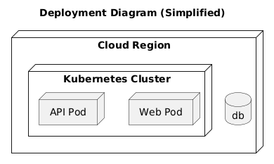
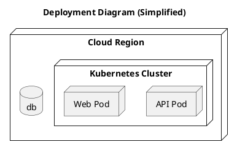

# Deployment View

[Open in PlantUML](https://uml.shafie.org/uml/JP11JWCn34NtESLNDmK9E0DLkq4i6844QsViQICooIXng01LuWxSa9FWQcZ5mbduoT_FMJu7beo7X8sCb1XT91ro6V7pzGsMAURtKPA20sqBZQZQl5kkK9klVGcJXfokFLLXJATHUz2gb0hDeBwNMd7CtfFsExmTDzOhv66G4j8MWv2s8XKnl0eccyk9OlYmIAQwyvaApm6sYcVDFYSrhHldRgjIqJP6fq6Zs1rdvysVyyLJ6ASOXY1ywLpAB5YiOswCHzcQ_mAV3fZxzyrBIQAciuwjgfIPdlYgkqENUG4ofIdy8o_YpsGltiZ1Yadf-3rWxmvcAudDzHS0)

## Requirements

- The deployment model shall include a node api representing API Pod, and infrastructure tasks must ensure it is provisioned, monitored, and reachable by its peers.
- The deployment model shall include a node web representing Web Pod, and infrastructure tasks must ensure it is provisioned, monitored, and reachable by its peers.
- The deployment model shall include a database db, and infrastructure tasks must provision, secure, and monitor it.
- The development team shall treat each visual element as either a deployable artifact, a runtime capability, or an integration point, and create tasks to build, configure, and test each of them.
- Non-functional requirements (performance, security, observability, resilience) must be applied to all links and components shown in the diagram.

---

_Source: generated from [ArchAiTect Workbench](https://workbench.shafie.org/projects/test-8/)_
