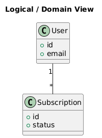
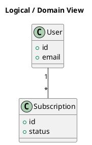

# Logical View

[Open in PlantUML](https://uml.shafie.org/uml/LOz1IWD144NtVOhFR0BgADv08KiXWfXzJNTDKjZJFNHL6r04x-0DFOazna3SrARgl_zgjPN06Pk4DK-K0XuZsPZBXE_FByIy4qyHGMXNQ89Q7Tpg7be7zKLcavpwWPG3vbEk3LJbeh0CyfvLiO0FP7wFrwLEhv37aOka7KOcguKLKLuOSylbH57U6ZAGxeTC9Hm1hIeS7NrEnickdRjJes9rYix48kFXJ_W6wpoH96o53yxvICtYkLdXtG6N4fRPO1BTnsdzTFRK-LchiAhBtI-Wk-tGz-Wkkd-9vi8fD9CV)

## Requirements

- This diagram defines the primary elements and relationships for Logical View, and implementation must ensure that all shown components, connections, and responsibilities are realized in code, configuration, and infrastructure.
- The development team shall treat each visual element as either a deployable artifact, a runtime capability, or an integration point, and create tasks to build, configure, and test each of them.
- Non-functional requirements (performance, security, observability, resilience) must be applied to all links and components shown in the diagram.

---

_Source: generated from [ArchAiTect Workbench](https://workbench.shafie.org/projects/test-8/)_
