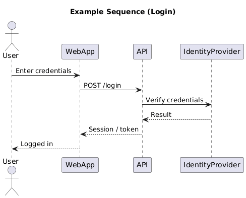
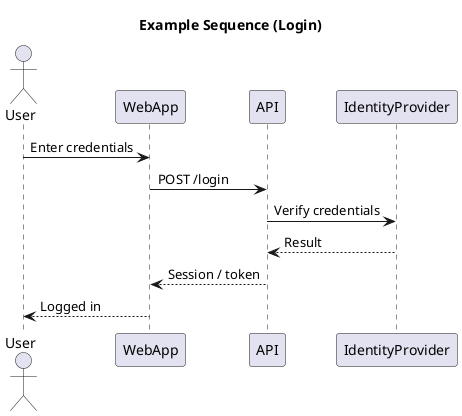

# Sequence Diagram

[Open in PlantUML](https://uml.shafie.org/uml/NP71JiCm38RlUGhV1X9ZznxG9h739AHL3CRPJTmkMfg4n0N6YNVW3NaI7CeGswLH7Vlpfp-JhJKKOEtXbdhq1cg7t8RKmzV79sHw7iXh0cEnIzX3vg5HamNaeSawsSWs-6c3cGp4uw1yOCYKCd00r9foXa9-HTOxU2dxyXM4jgLaVGSj8G-9CZYx9uWo5pmw-ov8WtdN14nc1CWgCqhgu9ayNoirpuo9Xzufjkm8bc_OHpatH_EBkz1PVwaKQXQnHn5JKKQijX4zmnCrYnXFIejwTVA_ChBByg5EeTWdfGe5fZU_mnKiHIU1JlJJYIwhyQRq2As2UhrvW9ahAaeAfNvEhM0hWRI74ynv4qoFn7lAW-CHziza8sdBcy1Cmj-J__EGbY9TWSJHIRJYeURaZIJt3G00)

## Requirements

- The system shall support an interaction where User sends the message 'Enter credentials' to WebApp, and the platform must be able to process this exchange end-to-end.
- The system shall support an interaction where WebApp sends the message 'POST /login' to API, and the platform must be able to process this exchange end-to-end.
- The system shall support an interaction where API sends the message 'Verify credentials' to IdentityProvider, and the platform must be able to process this exchange end-to-end.
- The system shall support an interaction where IdentityProvider sends the message 'Result' to API, and the platform must be able to process this exchange end-to-end.
- The system shall support an interaction where API sends the message 'Session / token' to WebApp, and the platform must be able to process this exchange end-to-end.
- The system shall support an interaction where WebApp sends the message 'Logged in' to User, and the platform must be able to process this exchange end-to-end.
- The development team shall treat each visual element as either a deployable artifact, a runtime capability, or an integration point, and create tasks to build, configure, and test each of them.
- Non-functional requirements (performance, security, observability, resilience) must be applied to all links and components shown in the diagram.

---

_Source: generated from [ArchAiTect Workbench](https://workbench.shafie.org/projects/test-8/)_
