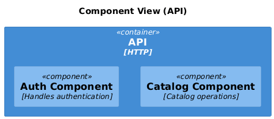
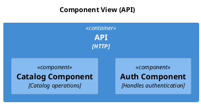

# C4 Component

[Open in PlantUML](https://uml.shafie.org/uml/LO-zRW8n48HxFyNa6a3AJqCPHK6N8kae42rQx8MpvBCjUmyKHP7o3dd3F4aM245KQtsQ6S-CbjvnmWlLRfseECnoni_ND-nqPLEVK-GeS9wsXNfK6TPcD4DX2dVYUyRkQDzvtlku1UKSl2NnAMAJ2eRAfK8IgktO3O51qM5FOZlO5EMKNTXAUCUcf1xIiIzmvphtnZnNeI937yoDZpOCZl7OJX_QwQezztioHhne-Z_1KXjXF9k_JOnfzIVoaSkOihz5exJHyxfOp9i9FWmklZ4DqXqaUYxqgDRcWIiE0aL_Avl9bLiXXRHLUNjwNMUSOSfSZlQg_a-ToD7fm5y0)

## Requirements

- The design shall define a container api named API (HTTP), and implementation work must provision it as a distinct deployable or conceptual element.
- The design shall define a component auth named Auth Component (Handles authentication), and implementation work must provision it as a distinct deployable or conceptual element.
- The design shall define a component catalog named Catalog Component (Catalog operations), and implementation work must provision it as a distinct deployable or conceptual element.
- The development team shall treat each visual element as either a deployable artifact, a runtime capability, or an integration point, and create tasks to build, configure, and test each of them.
- Non-functional requirements (performance, security, observability, resilience) must be applied to all links and components shown in the diagram.

---

_Source: generated from [ArchAiTect Workbench](https://workbench.shafie.org/projects/v2-test/)_
