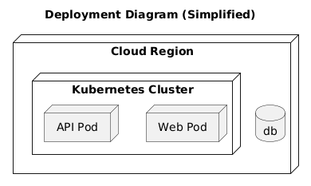
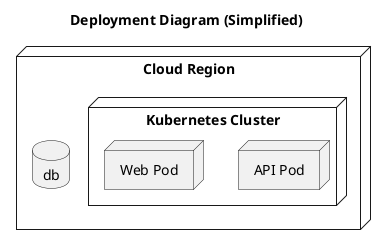

# Deployment View

[Open in PlantUML](https://uml.shafie.org/uml/JOz1JiGm34NtESLNDmCBE0FLT8FOZ0O9raxjjf7If4gSgKPe9Ex03Ja94MM0XJT--j_FknV74j5Hdcoan6YN1P_l7s1PV3pF4XJiQ4mq8sknPjSY2VaxTRFWz1q-ELbT647BubrFwcB041DAbfIX4RcVX8iNK62ifFs4FWRTkfFqwiyOKfoXaxW4lihS6_EGbPAMsHjrMXkwFwtkH-lcsStryE24Ruq9aGNDtiV2ECfONHgy6M3RFnKhAOXAnjwNh98sUkNjuH67o0qertVSF_8gzfUiOYkvr65IifG5RCsbsahWwle5)

## Requirements

- The deployment model shall include a node api representing API Pod, and infrastructure tasks must ensure it is provisioned, monitored, and reachable by its peers.
- The deployment model shall include a node web representing Web Pod, and infrastructure tasks must ensure it is provisioned, monitored, and reachable by its peers.
- The deployment model shall include a database db, and infrastructure tasks must provision, secure, and monitor it.
- The development team shall treat each visual element as either a deployable artifact, a runtime capability, or an integration point, and create tasks to build, configure, and test each of them.
- Non-functional requirements (performance, security, observability, resilience) must be applied to all links and components shown in the diagram.

---

_Source: generated from [ArchAiTect Workbench](https://workbench.shafie.org/projects/v2-test/)_
