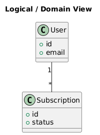
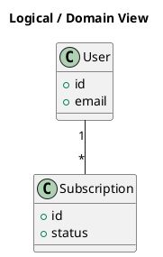

# Logical View

[Open in PlantUML](https://uml.shafie.org/uml/LOvDIWD148NtVOh7R0BA6Bo1WIpTIRAlwQxC5FGVtTK94WJlu0qzYPt1W6vgK-zxxziSnN72dkeo9IeEkvpn_Va5dsQnvE64va81LTjaDZiK9Z-g1CPv9S_25uapA6VV0PKKSKe5hNAfq8Hg5tRDCoWwN4Zj0fkYSjJUNTYgVyUff01TM0hStUJ9c9UgLBG5RrIqDxp-EcsnJu4aujZ7ZR6UQiMX3-9gW4TnjyizuSt7_VtMfcgBv5NmJwnFQAktt5emF0yOHmmFmp-Ykt1qtUG7)

## Requirements

- This diagram defines the primary elements and relationships for Logical View, and implementation must ensure that all shown components, connections, and responsibilities are realized in code, configuration, and infrastructure.
- The development team shall treat each visual element as either a deployable artifact, a runtime capability, or an integration point, and create tasks to build, configure, and test each of them.
- Non-functional requirements (performance, security, observability, resilience) must be applied to all links and components shown in the diagram.

---

_Source: generated from [ArchAiTect Workbench](https://workbench.shafie.org/projects/v2-test/)_
