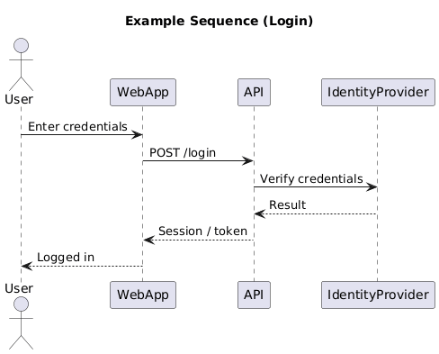
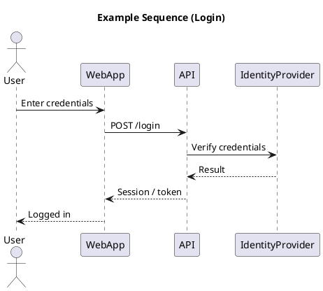

# Sequence Diagram

[Open in PlantUML](https://uml.shafie.org/uml/NP2nJWCn38RtF8KtO2ZTRq2jH8TAI5GKokmcxbr4BWcEhwKRxy0RyYGuBKMqKnJ7_lpblrfvHmdkiNJhXEnWcZDyVtv1eVU1eYLm7bl67eeCQtCr1IOC8_4zmVOmklMqyx45p3buY-9JX4rY60fn0KbGR4Tk20GO7UnGR0SsHQ4eocQo4lQmuTI3TEGPt4dbrfX94MGP-c34Yn9c7zXdFPSdkUk7rFfuOmnQqPqlkjDa7V7MPzG5hxJM3vsLfelvsNtkrCJBVi6fVeYDgHGOtVqEDp1JMGRBTEZ4KCpnfVOehO75u_8Png6g62tK-YMrWHMnt-pFC9TDC3eHdwWCGOwmVoPBAgNcEzPStoZ-UMXBbMv0usZ9WNgO2KMdoVq0)

## Requirements

- The system shall support an interaction where User sends the message 'Enter credentials' to WebApp, and the platform must be able to process this exchange end-to-end.
- The system shall support an interaction where WebApp sends the message 'POST /login' to API, and the platform must be able to process this exchange end-to-end.
- The system shall support an interaction where API sends the message 'Verify credentials' to IdentityProvider, and the platform must be able to process this exchange end-to-end.
- The system shall support an interaction where IdentityProvider sends the message 'Result' to API, and the platform must be able to process this exchange end-to-end.
- The system shall support an interaction where API sends the message 'Session / token' to WebApp, and the platform must be able to process this exchange end-to-end.
- The system shall support an interaction where WebApp sends the message 'Logged in' to User, and the platform must be able to process this exchange end-to-end.
- The development team shall treat each visual element as either a deployable artifact, a runtime capability, or an integration point, and create tasks to build, configure, and test each of them.
- Non-functional requirements (performance, security, observability, resilience) must be applied to all links and components shown in the diagram.

---

_Source: generated from [ArchAiTect Workbench](https://workbench.shafie.org/projects/v2-test/)_
