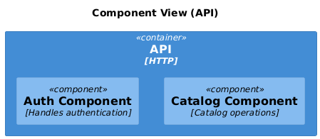
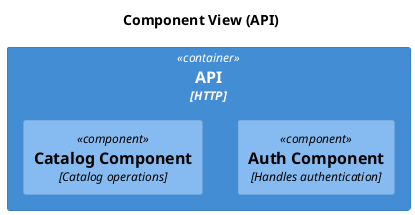

# C4 Component

[Open in PlantUML](https://uml.shafie.org/uml/LOz1IyD048Nl-okUkJI1efSSHIpneBSUIgzbiZjD1vBTiBjHK0J_W__GN-8aKajFCpo-zsRUQY-E0vuedTf0qU7dwnksFjWmZC6ppt12NQG1AK-jMMqm9OuGdpaUoJAE8MACd1GLty5IvYv4UMU7roNQ1cKr9tWGtFdE6cGjfoHjpmeIo6EpVRarvZ5bYdaQUdCZtlQJOzmtzLrJ7vhpJm_6PCbg_5Um5tv3gGcLCOrU9F4SInfbZKBLGiVpRhSjAdmON7mbJVaq8pekwaAJTpqdpC3SJOj9y4LrvLQH-j0ftlnjrnbdCOmS5tjI_wTMPE-qu2y0)

## Requirements

- The design shall define a container api named API (HTTP), and implementation work must provision it as a distinct deployable or conceptual element.
- The design shall define a component auth named Auth Component (Handles authentication), and implementation work must provision it as a distinct deployable or conceptual element.
- The design shall define a component catalog named Catalog Component (Catalog operations), and implementation work must provision it as a distinct deployable or conceptual element.
- The development team shall treat each visual element as either a deployable artifact, a runtime capability, or an integration point, and create tasks to build, configure, and test each of them.
- Non-functional requirements (performance, security, observability, resilience) must be applied to all links and components shown in the diagram.

---

_Source: generated from [ArchAiTect Workbench](https://workbench.shafie.org/projects/v3-test/)_
