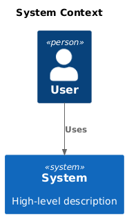
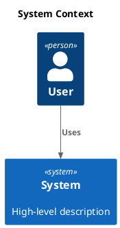

# C4 Context

[Open in PlantUML](https://uml.shafie.org/uml/FOvDJiD038NtSmgJJOjKO9CbGgtI1Umg46mhPyPDBIMUQknKm8exS4DEWac0bN-Ut-UtUE546RQenpPZIV3ryGcntiSiHgy6YR4hE83Qs8R51aQb0knQEM0aEEG2fq9AOYmTH3JgSk5tId2Um1D73B80GlhxiWACaLIvxSaF4L1Witku3c6jXiN6eGyNBB4V4y5jKzyqzRvn4h9GkGl1sDpuzAP60pHpr11sL3JByYVY2gfdBzLbc8-MEXLVptFbtJrtnwkUpjH38es5JyPPtF98_I_at-KmTIMiIPA7-mO0)

## Requirements

- The design shall define a person user named User, and implementation work must provision it as a distinct deployable or conceptual element.
- The design shall define a system system named System (High-level description), and implementation work must provision it as a distinct deployable or conceptual element.
- The architecture shall include a relationship where user uses system, and this connection must be implemented with appropriate protocols, security, and error handling.
- The development team shall treat each visual element as either a deployable artifact, a runtime capability, or an integration point, and create tasks to build, configure, and test each of them.
- Non-functional requirements (performance, security, observability, resilience) must be applied to all links and components shown in the diagram.

---

_Source: generated from [ArchAiTect Workbench](https://workbench.shafie.org/projects/v3-test/)_
