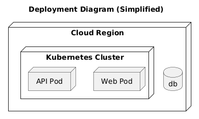
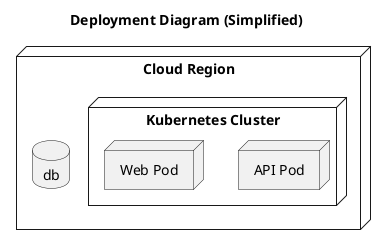

# Deployment View

[Open in PlantUML](https://uml.shafie.org/uml/JOv1IWGn44NtESMdDwCWdi5XUYDk1WLTLrBLRK4wQLA9eZBW7RoX9p4uZhgeJRtF_szphomP8zcZprGOd-yVO5bZVbaaLR3IN6Y1rURTPejcKg2fIfae2APSi1Qn7jKq8r2LEHTz5SRJTt78FTjxSWA1JoiNe134J7sK7YHGmdP_VUdSbLKgjItHLQqTZdyguu_AsPqkQzH9XS-TIva5moxcnhYLMNCQyEQ0u_-cUIb9gXXsiLdNFj8JxwFOPnv01bhr7taG_qkUnNTowCTKoPC9sBj3jvN4tVKB)

## Requirements

- The deployment model shall include a node api representing API Pod, and infrastructure tasks must ensure it is provisioned, monitored, and reachable by its peers.
- The deployment model shall include a node web representing Web Pod, and infrastructure tasks must ensure it is provisioned, monitored, and reachable by its peers.
- The deployment model shall include a database db, and infrastructure tasks must provision, secure, and monitor it.
- The development team shall treat each visual element as either a deployable artifact, a runtime capability, or an integration point, and create tasks to build, configure, and test each of them.
- Non-functional requirements (performance, security, observability, resilience) must be applied to all links and components shown in the diagram.

---

_Source: generated from [ArchAiTect Workbench](https://workbench.shafie.org/projects/v3-test/)_
