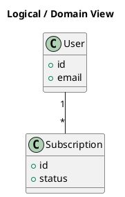

# Logical View

[Open in PlantUML](https://uml.shafie.org/uml/LOv1IWD144NtVOhFR09g56zW81iX2q7ClgQxCXRqT8UgQWL5y0xUq9FO4mpefZR_rVzljPV45Lkovx6I9dn_VY7NII9b9A59QOPv6yDgWsQiaEAi1ugCGrKSbOsBIvaGoNcgAc-Sy79gZRMpnL4B2EaySGMAaSrapDn10XLi7kwlGxWp9_Ksv-3YFTpzUjnWMsUIWhtmQmWnancU5fdt05nAMYvt8eUFS_pOHeigHvU-_WVh4zviuKu5m-s0zHh3nV3lexjmITta1m00)

## Requirements

- This diagram defines the primary elements and relationships for Logical View, and implementation must ensure that all shown components, connections, and responsibilities are realized in code, configuration, and infrastructure.
- The development team shall treat each visual element as either a deployable artifact, a runtime capability, or an integration point, and create tasks to build, configure, and test each of them.
- Non-functional requirements (performance, security, observability, resilience) must be applied to all links and components shown in the diagram.

---

_Source: generated from [ArchAiTect Workbench](https://workbench.shafie.org/projects/v3-test/)_
