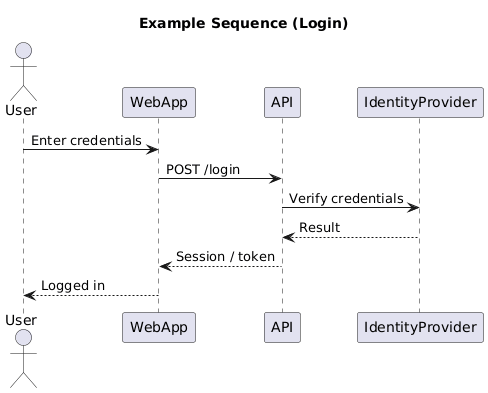
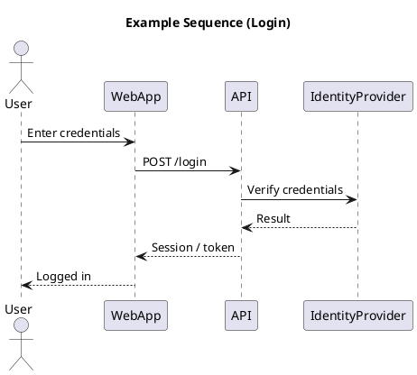

# Sequence Diagram

[Open in PlantUML](https://uml.shafie.org/uml/NP11JWCn34NtESNV5IHAzxD0hKGNbP2eA9Ir9t6d4JF9a7WGPSKTk24dmMafebr5iR-_d_zexHr7t5BUrf6Im_Vd5pA_3Xmimtbg4dN8CjHcDCEGES47uRGXRMzYGfyuSn0V6bWIRcBo7-pmjhUrKRL140C8xhZZ2cGjv-phbbL8e83PSd5jp3GB9HcwreWNRSxVgUlrNHs1BkvYuyEbCMH5bpyfZ-brn5lVaovwvdhMzoSbTJxvBrp1bTqonGAPZ2ak6D_y3bUObmDX4--Lr6Ppw1IDkbLOtgyUCMaBYj52gP-xLbXpyflTYSsv2EEZumFdePM3sJ-ILKb9mvj0uWk7FmwL5EWA6aUZQIk7cN9mcjmF)

## Requirements

- The system shall support an interaction where User sends the message 'Enter credentials' to WebApp, and the platform must be able to process this exchange end-to-end.
- The system shall support an interaction where WebApp sends the message 'POST /login' to API, and the platform must be able to process this exchange end-to-end.
- The system shall support an interaction where API sends the message 'Verify credentials' to IdentityProvider, and the platform must be able to process this exchange end-to-end.
- The system shall support an interaction where IdentityProvider sends the message 'Result' to API, and the platform must be able to process this exchange end-to-end.
- The system shall support an interaction where API sends the message 'Session / token' to WebApp, and the platform must be able to process this exchange end-to-end.
- The system shall support an interaction where WebApp sends the message 'Logged in' to User, and the platform must be able to process this exchange end-to-end.
- The development team shall treat each visual element as either a deployable artifact, a runtime capability, or an integration point, and create tasks to build, configure, and test each of them.
- Non-functional requirements (performance, security, observability, resilience) must be applied to all links and components shown in the diagram.

---

_Source: generated from [ArchAiTect Workbench](https://workbench.shafie.org/projects/v3-test/)_
