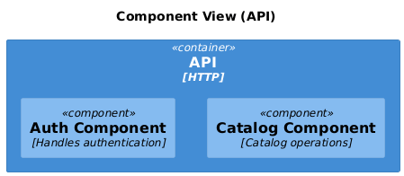
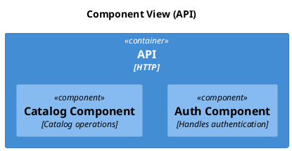

# C4 Component

[Open in PlantUML](https://uml.shafie.org/uml/LO_1IiGm48RlUOhVNhOBefSUHIpreBS55w_BD1tRG9g4P4fPHF0TV4EVnBIwBdkQyF5_a_atjTQSacajuv7Iq7gA7LwEINZ4z-SNT7NGVWpUiHDqXlf88v9ChThKcBa5XM2D9Z7UuSr7ZEIeDwu7hPkXlPFeRS9iP00vCAKZ-ecJO4eSuSFYtYZra8IYJADLLyPfEtMCkwQwRQf3SxhWNYanac_z9tWrFAEiTyzRfPhy5nd7iQHWhb5aMkJnjD_lYYtU5SvUIPCCIoIFCrtJv3hB2KiWexzknVR2pf2ixtEy-NrTxZX17pYkUih-Hwx8hii5Vm00)

## Requirements

- The design shall define a container api named API (HTTP), and implementation work must provision it as a distinct deployable or conceptual element.
- The design shall define a component auth named Auth Component (Handles authentication), and implementation work must provision it as a distinct deployable or conceptual element.
- The design shall define a component catalog named Catalog Component (Catalog operations), and implementation work must provision it as a distinct deployable or conceptual element.
- The development team shall treat each visual element as either a deployable artifact, a runtime capability, or an integration point, and create tasks to build, configure, and test each of them.
- Non-functional requirements (performance, security, observability, resilience) must be applied to all links and components shown in the diagram.

---

_Source: generated from [ArchAiTect Workbench](https://workbench.shafie.org/projects/v4-test/)_
