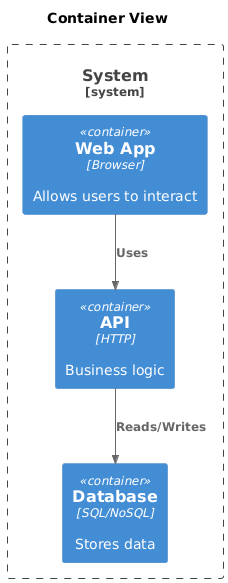
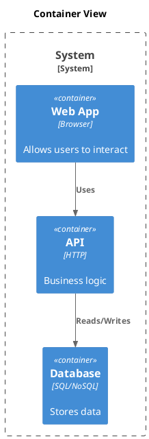

# C4 Container

[Open in PlantUML](https://uml.shafie.org/uml/NP3FIWCn4CRlUOfnBsr1xAL7aVuxA8ZKjjfZcKt6RI2RB9bPbYA2x-0R-YGckwZe9SpCb--RNp9QQ4tCjdG4Q-HJ6J0Qs9rPg8RFzm_GiwCENj1wYc0iLX5hO6bBDLf0HoLWqpYhKMpmy18YrEYnihu2x9CXksDm39sL4w07GZv3rH8Bj9n2GvEzLqhDMJ1AMpjrORrshI6uNiscgzbnzKrmevHOIQm_4tYsr2ar41-NeVK6utdCVNy9nI0K4tXLyEiQ9_8a7XB_eccAL2vZw19DBXVEfRg7Ov00rWj5r59C_aHWO_FbpLtstExtcpwcvIIcPxjGMVtFOVBEDGgMo9HlxnxlfmyXdNqZ8HA3INholQajkG5pMFJ4n6cUf_sW3ziI6fuUefLUL7Fo9dtW5m00)

## Requirements

- The design shall define a container web named Web App (Browser), and implementation work must provision it as a distinct deployable or conceptual element.
- The design shall define a container api named API (HTTP), and implementation work must provision it as a distinct deployable or conceptual element.
- The design shall define a container db named Database (SQL/NoSQL), and implementation work must provision it as a distinct deployable or conceptual element.
- The architecture shall include a relationship where web uses api, and this connection must be implemented with appropriate protocols, security, and error handling.
- The architecture shall include a relationship where api reads/writes db, and this connection must be implemented with appropriate protocols, security, and error handling.
- The development team shall treat each visual element as either a deployable artifact, a runtime capability, or an integration point, and create tasks to build, configure, and test each of them.
- Non-functional requirements (performance, security, observability, resilience) must be applied to all links and components shown in the diagram.

---

_Source: generated from [ArchAiTect Workbench](https://workbench.shafie.org/projects/v4-test/)_
