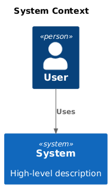
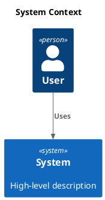

# C4 Context

[Open in PlantUML](https://uml.shafie.org/uml/FOwxJiD044Nx_OgBcmI9H-CIeKIce4GWwcYy7koHrhlMpfYGZd_W3_aIrd54DSzxT3PxxrbLsi1u8XtQHBd3sqcDH_n-_y3N1v-YyPUX4-epZL2RMxVPuyWjQ9g2U3994HyfOwH8lSGUTEPYoUOK54Un0HJ1f2VqCwjXLiv8qvAzSswdHjdcCRWhYJxC7UEXgU-R-j0K1ada_EYSYHNJYr-pYZdtmbbJt2x06rJlfLJNRdtQwhcKzJfNfNkMVhWD_Ca17QlFSdOeaLSE5yX_gi2qNDoEOrVa_W00)

## Requirements

- The design shall define a person user named User, and implementation work must provision it as a distinct deployable or conceptual element.
- The design shall define a system system named System (High-level description), and implementation work must provision it as a distinct deployable or conceptual element.
- The architecture shall include a relationship where user uses system, and this connection must be implemented with appropriate protocols, security, and error handling.
- The development team shall treat each visual element as either a deployable artifact, a runtime capability, or an integration point, and create tasks to build, configure, and test each of them.
- Non-functional requirements (performance, security, observability, resilience) must be applied to all links and components shown in the diagram.

---

_Source: generated from [ArchAiTect Workbench](https://workbench.shafie.org/projects/v4-test/)_
