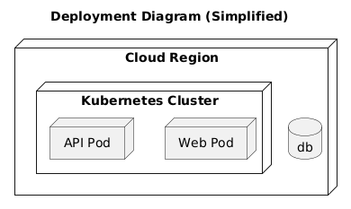
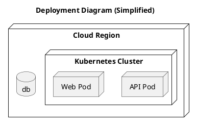

# Deployment View

[Open in PlantUML](https://uml.shafie.org/uml/JOyzRW8n48Lxd-9f6v8cPyWAcYWD2WNrU3qOI_vPUSP2gmY9Et33d2Gc12N5DFDfvhrlDKuJYmGR6HkIeorK7NQBA2TyNQvmFCUo9CuA5yXNIX1jrgn6dDY2vZc6YJIKZ4EfI9J9X-n1FtynbQorHC4fw16KmIGBV6DHDE6ACjzkNunv5QMgBKMZGMzj_e8tly5Fkv1wt26mUpOc5ySOrh4qXm_s_Sk0JmFSz-_DSisiB5Z7rdNgdJxuk7t3jhW195qY_2FxhlKWNR6JSnz7IfQ4uQmvzxQSNU_w3G00)

## Requirements

- The deployment model shall include a node api representing API Pod, and infrastructure tasks must ensure it is provisioned, monitored, and reachable by its peers.
- The deployment model shall include a node web representing Web Pod, and infrastructure tasks must ensure it is provisioned, monitored, and reachable by its peers.
- The deployment model shall include a database db, and infrastructure tasks must provision, secure, and monitor it.
- The development team shall treat each visual element as either a deployable artifact, a runtime capability, or an integration point, and create tasks to build, configure, and test each of them.
- Non-functional requirements (performance, security, observability, resilience) must be applied to all links and components shown in the diagram.

---

_Source: generated from [ArchAiTect Workbench](https://workbench.shafie.org/projects/v4-test/)_
