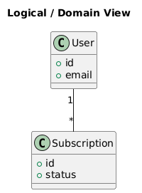
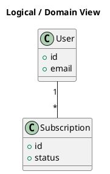

# Logical View

[Open in PlantUML](https://uml.shafie.org/uml/LOx1IWGn44Jl-OfYBWlAklW7BkpHswBtJgRDDcII8TrXM6J1V_0F_H8pWu9Uwb9Lhsft385LnIV6YVJY2zKHvwiQJ_Zw-4GgKG8bZ4AnqWIrvjtkY8KzQ9vJDqrAnbkfc2XJb1n16nIXPAibAHQn2oY3IQ-8ZTNGb2lAl7OVd7jIesfjIix4-fNddzK3JcKYoNWLNfmBYJhsPQs-E-1UnbMv9vAx_ThdvZLKsT1_Ott2cgwv3J0y3jZlCTmD_nhz2-UnF_a6)

## Requirements

- This diagram defines the primary elements and relationships for Logical View, and implementation must ensure that all shown components, connections, and responsibilities are realized in code, configuration, and infrastructure.
- The development team shall treat each visual element as either a deployable artifact, a runtime capability, or an integration point, and create tasks to build, configure, and test each of them.
- Non-functional requirements (performance, security, observability, resilience) must be applied to all links and components shown in the diagram.

---

_Source: generated from [ArchAiTect Workbench](https://workbench.shafie.org/projects/v4-test/)_
