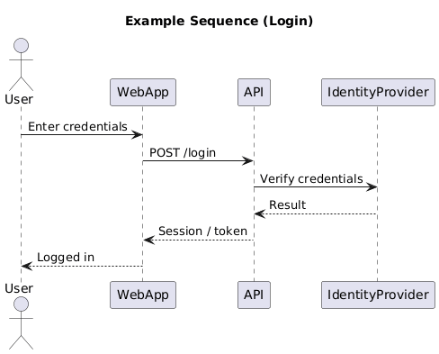
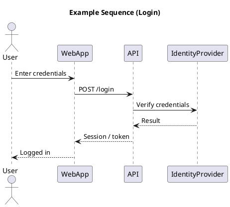

# Sequence Diagram

[Open in PlantUML](https://uml.shafie.org/uml/NP7DJiCm48JlVegv0OVIUmweaUYX4X8LuUUySRQfHM8RUqF9ZNVW3NaIDYr5j2VBuvblH-kBqbhEsTKTuvRojWwK6bHZ5kxn_Vc5p6y3Uyje7BM9UcGPQdDHOiSrACREMH8NF3OXeITFhVCjQ4-53LvIw39sJhOW3wOyeXqu2uRC2I5EsMjZ5baeoT1tHfneb-K7zL7FwZZ-yYue-SeOigAJdZHjeaQSTP6yu8NhCiOJgLolJkwhXhtIntKAxwxHl9aecDtyXWiilQXW4--Tr6LpU9ayIYkmlgyUCU-cAaQ5IJ-d5dZcv3RZ2URSXDcH-C1vwEG0-zUacZv5jpg7X5VsVptKCfKkeEjekO7sC0lsZMxk1m00)

## Requirements

- The system shall support an interaction where User sends the message 'Enter credentials' to WebApp, and the platform must be able to process this exchange end-to-end.
- The system shall support an interaction where WebApp sends the message 'POST /login' to API, and the platform must be able to process this exchange end-to-end.
- The system shall support an interaction where API sends the message 'Verify credentials' to IdentityProvider, and the platform must be able to process this exchange end-to-end.
- The system shall support an interaction where IdentityProvider sends the message 'Result' to API, and the platform must be able to process this exchange end-to-end.
- The system shall support an interaction where API sends the message 'Session / token' to WebApp, and the platform must be able to process this exchange end-to-end.
- The system shall support an interaction where WebApp sends the message 'Logged in' to User, and the platform must be able to process this exchange end-to-end.
- The development team shall treat each visual element as either a deployable artifact, a runtime capability, or an integration point, and create tasks to build, configure, and test each of them.
- Non-functional requirements (performance, security, observability, resilience) must be applied to all links and components shown in the diagram.

---

_Source: generated from [ArchAiTect Workbench](https://workbench.shafie.org/projects/v4-test/)_
