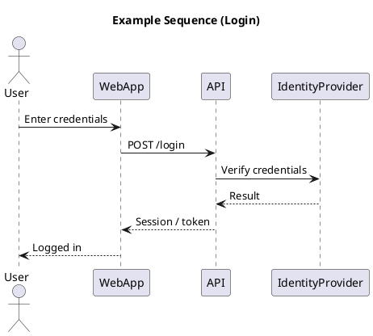
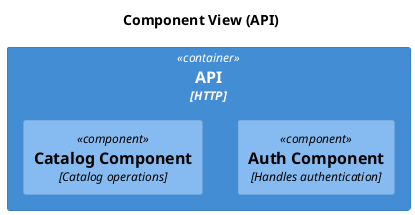
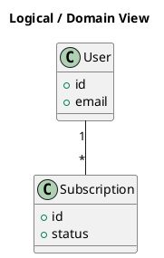
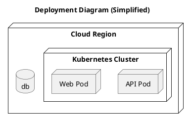

# V2 Test PRD v1

**Version:** v1
**Last Updated:** 2025-01-27
**Status:** Draft

---

## Version Info

- **Current Version:** v1
- **Last Updated:** 2025-01-27
- **Previous Versions:** None

---

## Problem & Goals

### Problem
Build a real-time video viewing application (Video Dashboard App) that allows users to schedule and watch content directly from their dashboard. The system requires a complete authentication flow, component architecture, domain modeling, and deployment infrastructure.

### Goals
1. Implement secure authentication flow with IdentityProvider integration
2. Build component-based API architecture (Auth Component, Catalog Component)
3. Establish domain models (User, Subscription) with proper relationships
4. Deploy system on Kubernetes with proper infrastructure provisioning
5. Ensure all components meet non-functional requirements (performance, security, observability, resilience)

---

## Non-Goals (v1)

- Video streaming functionality (out of scope for v1)
- Advanced subscription management features beyond basic model
- Multi-tenant architecture
- OAuth provider integrations beyond IdentityProvider
- Advanced catalog search/filtering features

---

## User Stories

1. **As a user**, I want to log in with my credentials so that I can access the video dashboard
2. **As a user**, I want my login session to be securely managed so that my account is protected
3. **As a system**, I need to verify user credentials through IdentityProvider so that authentication is secure
4. **As a developer**, I need component-based architecture so that the system is maintainable and scalable
5. **As an operator**, I need infrastructure monitoring so that the system is observable and reliable

---

## Flows

### 1. Authentication Flow (Sequence Diagram)

**Summary:** Complete login flow from user credential entry through IdentityProvider verification to logged-in state.

**Flow Steps:**
1. User enters credentials in Web App
2. Web App sends POST /login to API
3. API forwards credential verification to IdentityProvider
4. IdentityProvider returns verification result to API
5. API generates session/token and returns to Web App
6. Web App displays "Logged in" confirmation to User

**Diagram:**

**Source:** [Sequence Diagram](docs/diagrams/v2-test/sequence.md)

---

### 2. Component Architecture (C4 Component Diagram)

**Summary:** API container structure with Auth Component and Catalog Component for modular architecture.

**Components:**
- **API Container (HTTP)**: Main API container
  - **Auth Component**: Handles authentication logic
  - **Catalog Component**: Handles catalog operations

**Diagram:**

**Source:** [C4 Component Diagram](docs/diagrams/v2-test/c4_component.md)

---

### 3. Domain Model (Logical/Domain Diagram)

**Summary:** Core domain entities and their relationships for the video dashboard application.

**Entities:**
- **User**: Represents application users
  - Attributes: id, email
- **Subscription**: Represents user subscriptions
  - Attributes: id, status
- **Relationship**: User (1) → Subscription (*) - One user can have many subscriptions

**Diagram:**

**Source:** [Logical/Domain Diagram](docs/diagrams/v2-test/logical.md)

---

### 4. Deployment Architecture (Deployment Diagram)

**Summary:** Kubernetes-based deployment with API Pod, Web Pod, and Database in a cloud region.

**Infrastructure:**
- **Cloud Region**: Hosting environment
  - **Kubernetes Cluster**: Container orchestration
    - **API Pod**: API container deployment
    - **Web Pod**: Web application deployment
  - **Database**: Persistent data storage

**Diagram:**

**Source:** [Deployment Diagram](docs/diagrams/v2-test/deployment.md)

---

## Functional Requirements

### FR1: IdentityProvider Integration
- API must integrate with IdentityProvider for credential verification
- API must handle IdentityProvider responses (success/failure)
- API must process verification results and generate session/token
- Error handling required for IdentityProvider communication failures

### FR2: Web App Login Interface
- Web App must provide interface for credential entry
- Web App must send POST /login requests to API
- Web App must handle API responses and display appropriate messages
- Web App must securely store session/token from API
- Web App must display "Logged in" confirmation to user

### FR3: API Authentication Endpoint
- API must expose POST /login endpoint
- API must accept credential requests from Web App
- API must forward credential verification to IdentityProvider
- API must generate session/token upon successful authentication
- API must return session/token to Web App

### FR4: Auth Component
- Auth Component must be implemented within API container
- Auth Component must handle all authentication logic
- Auth Component must integrate with IdentityProvider
- Auth Component must manage session/token generation
- Non-functional requirements must be applied

### FR5: Catalog Component
- Catalog Component must be implemented within API container
- Catalog Component must handle catalog operations
- Catalog Component must integrate with database
- Non-functional requirements must be applied

### FR6: Domain Models
- User model must be implemented with id and email fields
- Subscription model must be implemented with id and status fields
- 1-to-many relationship must be established (User → Subscription)
- Database schema must be created and migrated
- Non-functional requirements must be applied

### FR7: Deployment Infrastructure
- API Pod must be provisioned, monitored, and reachable by peers
- Web Pod must be provisioned, monitored, and reachable by peers
- Database must be provisioned, secured, and monitored
- All infrastructure must support authentication flows
- Non-functional requirements must be applied

### FR8: Integration Testing
- End-to-end authentication flow must be tested
- All component interactions must be verified
- Error scenarios must be tested
- Session/token generation and storage must be validated

---

## Acceptance Criteria

1. User can enter credentials in Web App and receive logged-in confirmation
2. Web App successfully communicates with API via POST /login
3. API successfully communicates with IdentityProvider for credential verification
4. Session/token is generated and stored securely upon successful authentication
5. Auth Component handles all authentication logic within API container
6. Catalog Component handles catalog operations within API container
7. User and Subscription domain models are implemented with proper relationship
8. API Pod, Web Pod, and Database are provisioned and monitored in Kubernetes
9. All components meet non-functional requirements (performance, security, observability, resilience)
10. End-to-end integration tests pass for complete authentication flow

---

## Open Questions

1. What IdentityProvider will be used? (Supabase Auth, Auth0, custom?)
2. What session/token format? (JWT, OAuth tokens, custom?)
3. What database technology? (PostgreSQL, MySQL, other?)
4. What Kubernetes distribution? (EKS, GKE, AKS, local?)
5. What monitoring/observability stack? (Prometheus, Datadog, other?)
6. What security requirements for API-to-IdentityProvider communication?
7. What performance SLAs for authentication flow?
8. What catalog operations are required in v1?

---

## Links

- **Repository:** https://github.com/SevDev21/disney-ai-plus
- **Diagram Sources:**
  - [Sequence Diagram](docs/diagrams/v2-test/sequence.md)
  - [C4 Component Diagram](docs/diagrams/v2-test/c4_component.md)
  - [Logical/Domain Diagram](docs/diagrams/v2-test/logical.md)
  - [Deployment Diagram](docs/diagrams/v2-test/deployment.md)

---

## Related Issues

### GitHub Issues

- #42 - [V2 Test: Implement IdentityProvider Integration](https://github.com/SevDev21/disney-ai-plus/issues/42)
- #43 - [V2 Test: Implement Web App Login Interface](https://github.com/SevDev21/disney-ai-plus/issues/43)
- #44 - [V2 Test: Implement API POST /login Endpoint](https://github.com/SevDev21/disney-ai-plus/issues/44)
- #45 - [V2 Test: Implement Auth Component in API](https://github.com/SevDev21/disney-ai-plus/issues/45)
- #46 - [V2 Test: Implement Catalog Component in API](https://github.com/SevDev21/disney-ai-plus/issues/46)
- #47 - [V2 Test: Implement User and Subscription Domain Models](https://github.com/SevDev21/disney-ai-plus/issues/47)
- #48 - [V2 Test: Deployment Infrastructure Setup](https://github.com/SevDev21/disney-ai-plus/issues/48)
- #49 - [V2 Test: End-to-End Integration Testing](https://github.com/SevDev21/disney-ai-plus/issues/49)

### Related Linear Issues

None (to be created manually if needed)

---

## Linear Issue Templates

If Linear issue templates are generated, they will be available at:
- [Linear Templates](docs/linear-templates/v2-test-linear-templates.md)

---

## Requirements (from Diagrams)

### Sequence Diagram Requirements
- The system shall support an interaction where User sends the message 'Enter credentials' to WebApp
- The system shall support an interaction where WebApp sends the message 'POST /login' to API
- The system shall support an interaction where API sends the message 'Verify credentials' to IdentityProvider
- The system shall support an interaction where IdentityProvider sends the message 'Result' to API
- The system shall support an interaction where API sends the message 'Session / token' to WebApp
- The system shall support an interaction where WebApp sends the message 'Logged in' to User
- Non-functional requirements (performance, security, observability, resilience) must be applied to all links and components

### C4 Component Requirements
- The design shall define a container api named API (HTTP)
- The design shall define a component auth named Auth Component (Handles authentication)
- The design shall define a component catalog named Catalog Component (Catalog operations)
- Each visual element must be treated as either a deployable artifact, a runtime capability, or an integration point
- Non-functional requirements (performance, security, observability, resilience) must be applied

### Deployment Requirements
- The deployment model shall include a node api representing API Pod
- The deployment model shall include a node web representing Web Pod
- The deployment model shall include a database db
- Infrastructure tasks must ensure all nodes are provisioned, monitored, and reachable
- Non-functional requirements (performance, security, observability, resilience) must be applied

### Logical/Domain Requirements
- This diagram defines the primary elements and relationships for Logical View
- Implementation must ensure that all shown components, connections, and responsibilities are realized
- Non-functional requirements (performance, security, observability, resilience) must be applied

---

_Source: Generated from diagrams in [docs/diagrams/v2-test/](docs/diagrams/v2-test/)_